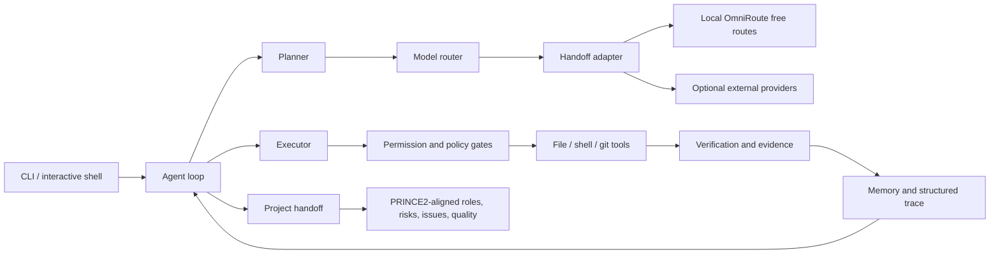

# Stagewarden architecture

Stagewarden separates delivery governance from model execution. Model output is treated as a proposal; policy, execution, evidence, and project state remain deterministic application concerns.



## Main boundaries

| Boundary | Responsibility | Safety property |
|---|---|---|
| CLI and command dispatch | Parse requests and choose governed workflow | Commands have explicit schemas and usage paths |
| Agent loop | Plan, execute, validate, stop or escalate | Bounded iterations and explicit completion |
| Model router/handoff | Select provider/model/account and invoke adapter | Provider state separated from execution policy |
| Executor | Run typed actions | Workspace confinement, permission checks, timeout and verification |
| Trace/memory | Record attempts, outcomes and evidence | Persistent, inspectable delivery history |
| Project handoff | Preserve delivery context across sessions | Explicit stage, decision, risk, issue and quality state |
| Role runtime | Route bounded context among PRINCE2-aligned nodes | Accountability and context slices stay explicit |

## Model execution

`RUN_MODEL_BIN` is the adapter boundary. Production-like local checks can use:

```bash
export RUN_MODEL_BIN="$PWD/scripts/run_model_omniroute.py"
export STAGEWARDEN_OMNIROUTE_MODEL="auto/coding:free"
```

The bundled OmniRoute adapter defaults to free routes and falls back only across:

1. `auto/coding:free`
2. `auto/best-free`
3. `coding-free-fallback`

External live-provider tests are opt-in. Offline CI does not require credentials or network model calls.

## Mutation path

1. Planner proposes typed action.
2. Policy layer classifies operation and permission requirement.
3. Executor validates workspace target and runtime constraints.
4. Tool performs mutation.
5. Executor reads back or otherwise verifies result.
6. Trace and handoff persist evidence and next state.
7. Agent either continues, completes, or emits exception/escalation information.

## Test strategy

- Full offline suite: 470 tests.
- Live OmniRoute smoke test: opt-in with `RUN_OMNIROUTE_LIVE_TEST=1`.
- External provider tests: skipped unless credentials are intentionally supplied.
- GitHub Actions runs only deterministic offline suite on push and pull request.

## Known limits

- Provider catalogs can change independently; dynamic metadata needs periodic refresh.
- Interactive role selection depends on current catalog ordering, so tests assert stable semantic choices rather than retired providers.
- Stagewarden assists delivery governance; it does not replace accountable human approval for high-impact production changes.
